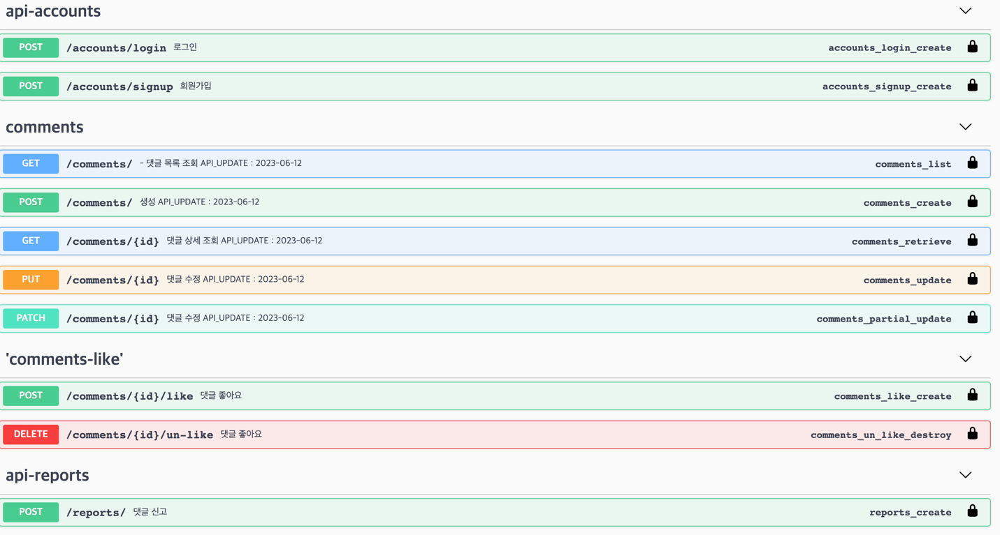
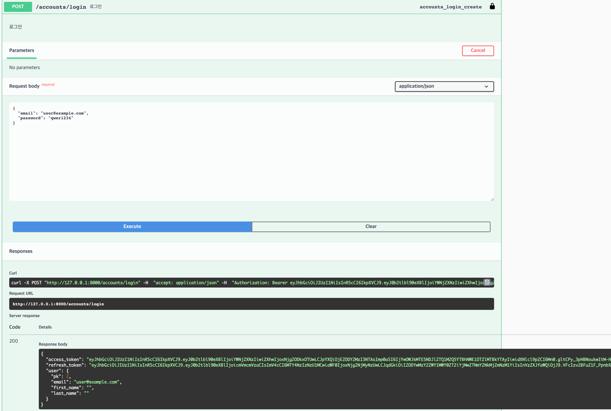
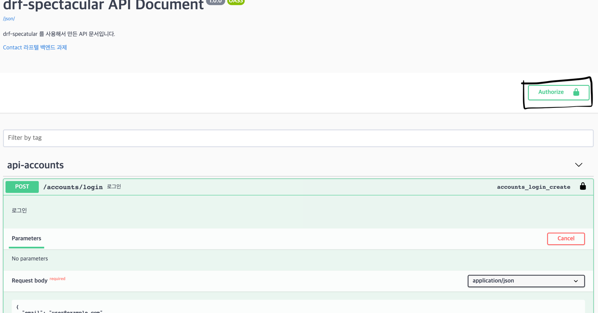
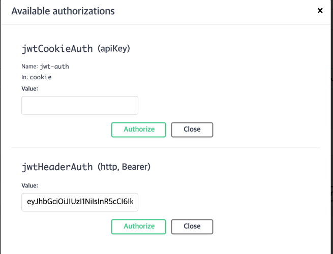

# Simwanwoo-laftel-backend-test
심완우 라프텔 백엔드 사전 과제입니다

프로젝트 실행 방법

Django runserver 실행 방법 및 접속 URL

requirements.txt 패키지 설치

pip install -r requirements.txt

터미널에서 python manage.py runserver 입력 후 http://127.0.0.1:8000/ 접속

### 요구사항

1. 현재 구현 상태의 개선점을 파악하고 자유롭게 수정을 진행해주세요. 
    1. 데이터 백필은 고려하지 않으셔도 됩니다 
    2. 기존의 url, api, model 코드를 그대로 유지하지 않으셔도 됩니다. 
2. 추가 기능을 구현해주세요.
    1. 댓글 대한 스포일러 신고 기능을 추가해 주세요.
        1. 스포일러 신고 수가 5개 이상인 댓글은, 댓글 조회 API 응답에서 댓글 내용 대신에 “스포일러 신고 접수된 댓글입니다” 라고 표시해주세요
        2. 다만 내가 작성한 댓글인 경우 스포일러 신고 갯수와 상관 없이 항상 댓글 내용이 보였으면 좋겠습니다.
    2. 댓글에 대한 좋아요 기능을 추가해주세요.
        1. 유저별로 댓글당 좋아요는 1번만 가능해야 합니다.
        2. 좋아요를 취소 할 수 있습니다.
        3. 댓글 조회 응답에서 해당 댓글의 좋아요 총 갯수를 함께 표시해주세요.
    3. 댓글 조회시 정렬 기능을 추가해주세요.
        1. 기본 최신순 이외에도 좋아요 순으로 댓글을 정렬 할 수 있는 기능을 추가해주세요.
        2. 내 댓글만 모아서 댓글 목록 최상단에서 볼 수 있었으면 좋겠어요.
    # 4. 추가기능
        1. 로그인, 회원가입
        2. 계정 한개로 하나의 댓글만 신고가능(중복신고 불가)
        3. 인증된 사용자만 댓글 작성 가능
        4. 본인 댓글만 수정 가능
        5. drf-spectacular사용 api 문서화

# 테스트코드 실행 방법
python manage.py test

# Swagger를 이용 API 테스트 하는 방법
http://127.0.0.1:8000/swagger 접속

/accounts/signup API를 이용하여 회원가입 후 진행 가능하며 

미리 생성해둔 계정으로 테스트 진행이 가능 합니다

Email - 

test@example.com

user@example.com

user2@example.com

user3@example.com

Password - 

qwer1234

로그인 방법

accounts/login 

로그인후 	
Response body값 access_token을 복사

상단에 있는 Authorize 클릭

 

복사해둔 토큰을 입력

로그아웃 후 로그인도 동일하게 진행 하시면 됩니다.

## 감사합니다.
